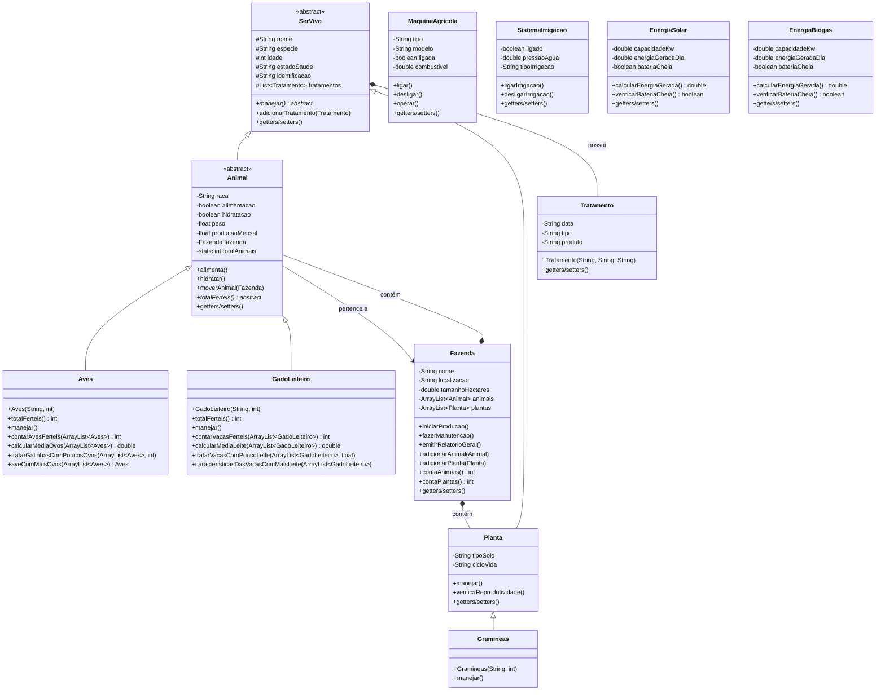

# Diagrama de Classes - Sistema de Fazenda

## Hierarquia de Classes e Relacionamentos



## Os 4 Pilares da Orientação a Objetos

### 1. **ENCAPSULAMENTO** 🔒
- **Atributos privados** com acesso controlado via getters/setters
- **Exemplos:**
  - `Animal`: atributos privados (`raca`, `peso`, `producaoMensal`)
  - `Fazenda`: listas privadas de animais e plantas
  - `MaquinaAgricola`: estado interno protegido (`ligada`, `combustivel`)

### 2. **HERANÇA** 🌳
- **Hierarquia bem definida:**
  ```
  SerVivo (abstract)
  ├── Animal (abstract)
  │   ├── Aves
  │   └── GadoLeiteiro
  └── Planta
      └── Gramineas
  ```
- **Reutilização de código** através da herança de atributos e métodos

### 3. **POLIMORFISMO** 🎭
- **Métodos abstratos** implementados diferentemente:
  - `manejar()`: cada classe tem sua implementação específica
  - `totalFerteis()`: lógica diferente para Aves e GadoLeiteiro
- **Sobrescrita de métodos** para comportamentos específicos

### 4. **ABSTRAÇÃO** 🎯
- **Classes abstratas:**
  - `SerVivo`: define estrutura comum para todos os seres vivos
  - `Animal`: especializa SerVivo para animais
- **Métodos abstratos** que devem ser implementados pelas subclasses
- **Interface comum** para diferentes tipos de objetos

## Relacionamentos Entre Classes

### **Composição** (tem-um forte)
- `Fazenda` **contém** `Animal` e `Planta`
- `SerVivo` **possui** `Tratamento`

### **Agregação** (tem-um fraco)
- `Animal` **pertence a** `Fazenda`

### **Herança** (é-um)
- `Aves` **é um** `Animal`
- `GadoLeiteiro` **é um** `Animal`
- `Gramineas` **é uma** `Planta`
- `Animal` **é um** `SerVivo`
- `Planta` **é um** `SerVivo`

### **Dependência** (usa)
- Classes utilizam `ArrayList` para coleções
- Métodos recebem objetos como parâmetros

## Funcionalidades Principais

### **Gestão de Animais**
- Controle de fertilidade e produção
- Manejo específico por tipo
- Análise de produtividade

### **Gestão de Plantas**
- Verificação de reprodutividade
- Manejo especializado

### **Infraestrutura**
- Sistemas de irrigação
- Máquinas agrícolas
- Geração de energia (solar/biogás)

### **Administração**
- Relatórios gerais
- Controle de tratamentos
- Gestão da fazenda
